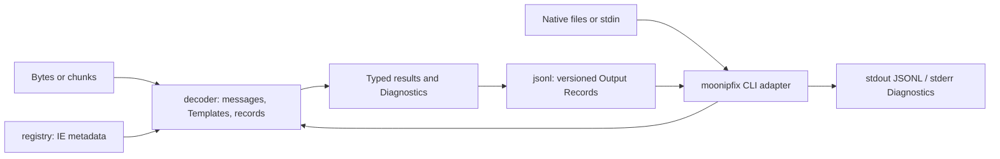

# Architecture

MoonIPFIX is organized around three deep public Modules and one Native adapter.

- **decoder** owns complete-message and arbitrary-chunk decoding, Template lifecycle, Sequence Gap detection, typed Data Records, configuration, and structured Diagnostics.
- **registry** owns the pinned IANA Registry Snapshot and caller-supplied Enterprise Information Element metadata.
- **jsonl** owns the schema-versioned Output Record contract used by scripts and the CLI.
- **cmd/moonipfix** adapts Native files, stdin, stdout, stderr, and process exit codes to the portable Modules.

## Interface depth

Callers learn one configuration model and one family of decoding results. Complete-message decoding and `StreamDecoder` share the same implementation rather than defining competing semantics. Template storage, safe cursor arithmetic, variable-length handling, padding checks, and recovery classification remain hidden.

The `registry` seam is real because the decoder accepts both the built-in IANA adapter and caller-provided Enterprise metadata. JSONL is a separate adapter because typed MoonBit values remain the core model and other output formats must not influence protocol decoding.

## Dependency direction

`registry` has no dependency on decoder or presentation packages. `decoder` may consume registry metadata. `jsonl` consumes decoder results and registry descriptions. The Native CLI consumes all three. Lower Modules do not import CLI, filesystem, terminal, or host-network capabilities.

## State and complexity

Template identity is `(Session Key, Observation Domain ID, Template ID)`. Resetting a Session removes all Template state for that Session; Template Withdrawal removes only the Templates selected by the RFC semantics. The decoder never infers a Session Key from an address or filename.

Decoding is planned as a single pass over input bytes and Template fields, with `O(n + f)` work for `n` input bytes and `f` decoded fields. Template lookup is expected `O(1)`. Retained state and buffered input are bounded by `DecoderConfig` limits.
